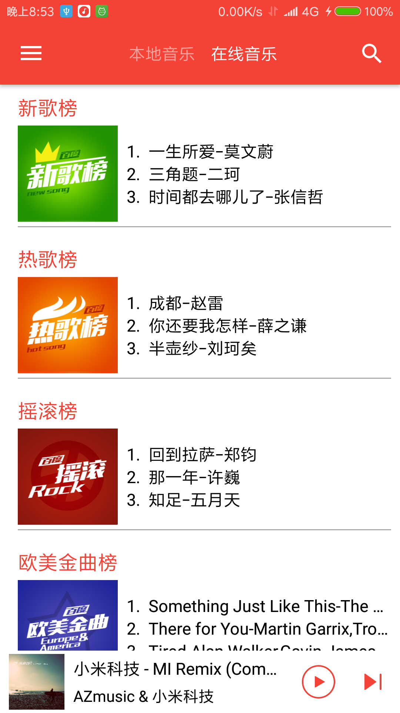
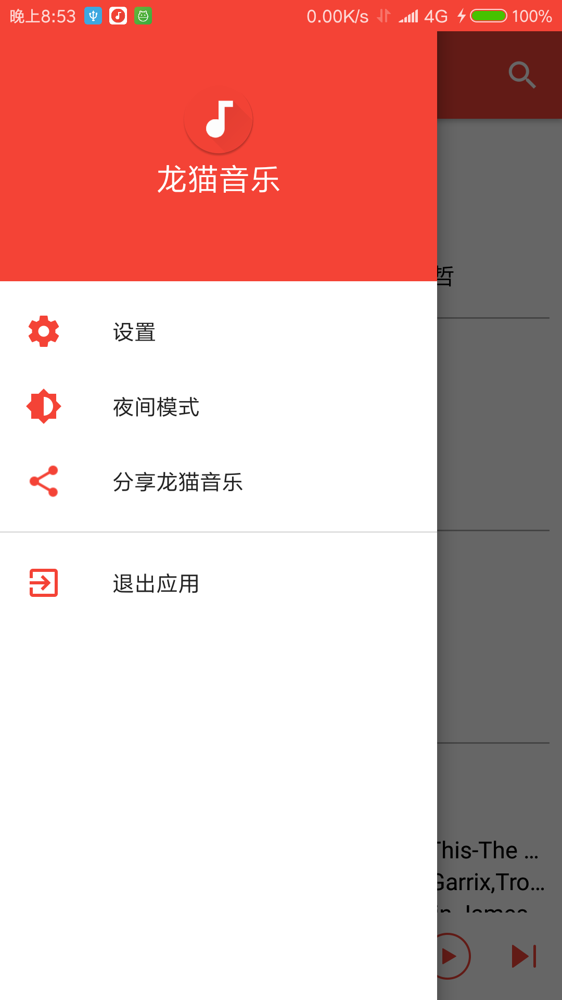
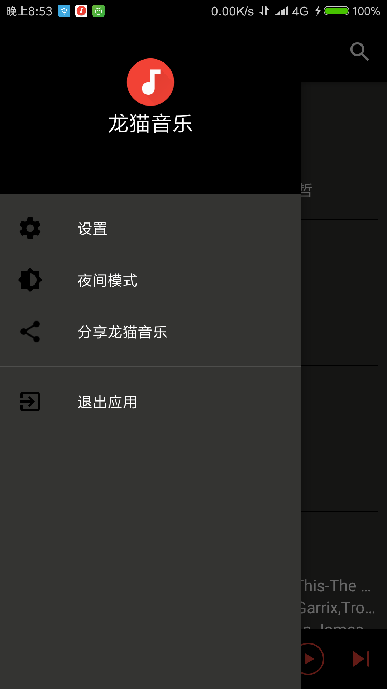

# TotoroMusic
### 前言
&ensp;&ensp;之前在github上看到了[PonyMusic](https://github.com/wangchenyan/PonyMusic)这个开源项目，出于学习的目的看了他的源代码，感觉收获颇丰，当时直接有了一种感觉，就是以前自己学到的零散的Android的知识全部都得到了使用。于是就下定决心也要写一个这样的APP，哪怕只是模仿。开始的头一个月，基本是依样画葫芦，加入了自己的一些代码。写到后面发现十分的困难，自己也渐渐掌控不住了。于是打算推到重写。第二次写就是完全按照自己的逻辑来写了。虽然中途困难重重，但是还是一路坚持了下来。只要自己不放弃，代码就不会放弃自己。
### 简介
&ensp;&ensp;龙猫音乐是一个轻量级的开源APP.借鉴了[PonyMusic](https://github.com/wangchenyan/PonyMusic).
### 预览
          

### 下载地址
[龙猫音乐](https://fir.im/TotoroMusic)

### 主要功能
- 支持本地歌曲播放
- 夜间模式
- 支持在线播放
- 拥有网络榜单
- 通知栏简易控制
- 搜索功能
- 网络歌曲可下载
- 模仿网易云的拨杆唱片
- 显示歌词

### 数据来源
[百度音乐API](http://www.jianshu.com/p/a6718b11fdf1)(请不要用于商业用途)

### 使用开源库
- [Gson](https://github.com/google/gson)
- [OkHttp](https://github.com/square/okhttp)
- [LrcView](https://github.com/wangchenyan/LrcView)
- [Glide](https://github.com/bumptech/glide)
- [CircleImageView](https://github.com/hdodenhof/CircleImageView)

十分感谢！！！！！！！

### 注意
&ensp;&ensp;百度音乐API是我未经许可擅自使用的，所以不能用于商业用途，大家也请不要随意传播数据，谢谢。
