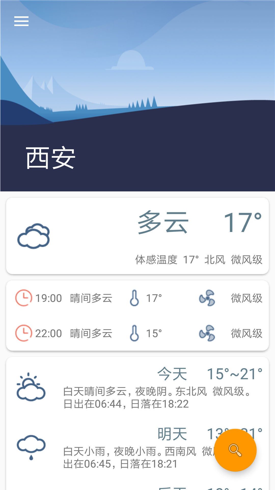
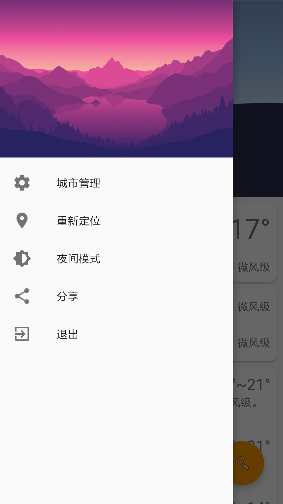
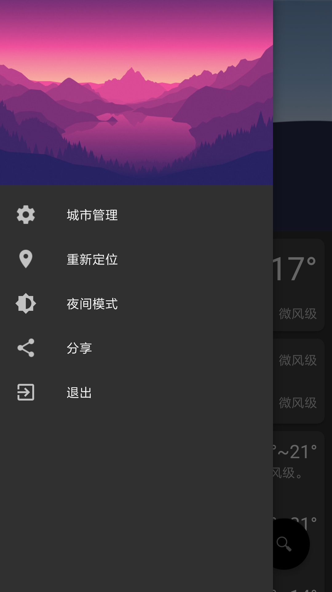
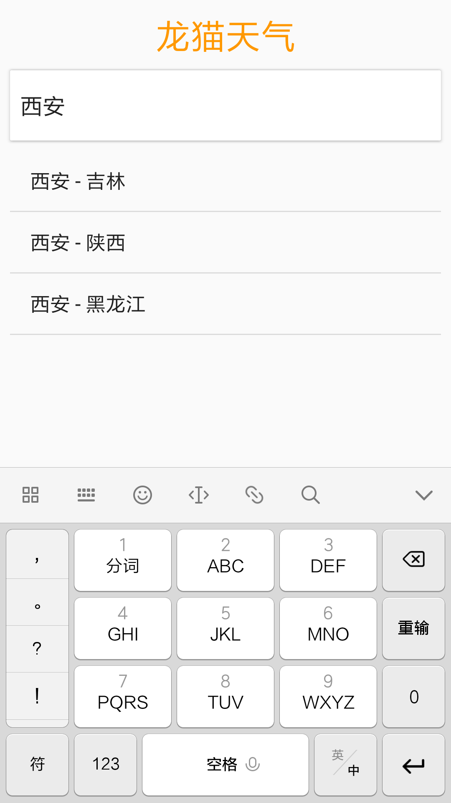

# TotoroWeather

### 简介

一个简单的天气应用,借鉴了[PonyWeather](https://github.com/wangchenyan/PonyWeather)的图片,遵循material design的设计风格

[下载地址 http://fir.im/TotoroWeather](http://fir.im/TotoroWeather)

### 预览   
                             

### 功能

- 自动定位
- 显示当前天气(包括未来3天,当天每3个小时一个信息,当天的一些建议)
- 存储已查询过的城市，可以手动删除
- 夜间模式
- 搜索城市

### 使用开源库

- [gson](https://github.com/google/gson)
- [Glide](https://github.com/bumptech/glide)
- [Okhttp](https://github.com/square/okhttp)
- [AwesomeSplash](https://github.com/ViksaaSkool/AwesomeSplash)

膜拜大佬！！！！

### 数据来源

- 天气信息-----》[和风天气](https://www.heweather.com/)
- 定位信息-----》[高德地图](http://lbs.amap.com/)

非常感谢！！！！

